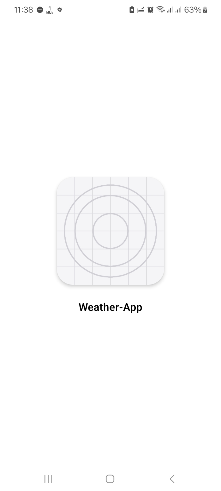

# 🌦️ Weather App

A simple **React Native + Expo** Weather App that allows users to search for any city and view real-time weather information such as **temperature, wind speed, humidity, sunrise, and sunset**. Built with the **OpenWeather API**, styled with gradients and vector icons.

---

## 🚀 Features
- 🔍 **City search with live suggestions** as you type  
- 🌡️ Displays **temperature in Celsius**  
- 💨 Shows **wind speed** (km/h)  
- 💧 Displays **humidity percentage**  
- 🌅 **Sunrise and Sunset times**  
- 🎨 Clean UI with gradient background and icons  

---

## 📸 Screenshots

| Home Screen | Search Input | Result  |
|-------------|----------------|------------------|
|  |  |  |

---

## 🛠️ Tech Stack
- **React Native** (Expo)
- **Expo Router** for navigation
- **OpenWeather API**
- **Expo Linear Gradient**
- **Expo Vector Icons**

---

## ⚙️ Installation & Setup
1. Clone this repository:
   ```bash
   git clone https://github.com/YOUR_USERNAME/weather-app.git
   ```
2. Navigate into the project folder:
   ```bash
   cd weather-app
   ```
3. Install dependencies:
   ```bash
   npm install
   ```
4. Add your **OpenWeather API Key**  
   - Create a `.env` file in the root directory  
   - Add this line:  
     ```
     WEATHER_API_KEY=your_api_key_here
     ```
   - Make sure `.env` is listed in `.gitignore`

5. Start the app:
   ```bash
   npx expo start
   ```

---

## 📂 Project Structure
```
weather-app/
 ├─ app/
 │   ├─ index.jsx        # Home screen
 │   └─ components/
 │       └─ WeatherCard.jsx
 ├─ .gitignore
 ├─ README.md
 ├─ package.json
 └─ ...
```

---

## 🌍 API Reference
Weather data is powered by [OpenWeather API](https://openweathermap.org/api).

Example endpoint for city weather:
```
https://api.openweathermap.org/data/2.5/weather?q=London&appid=YOUR_API_KEY&units=metric
```

---

## 📜 License
This project is open source and available under the [MIT License](LICENSE).

---
